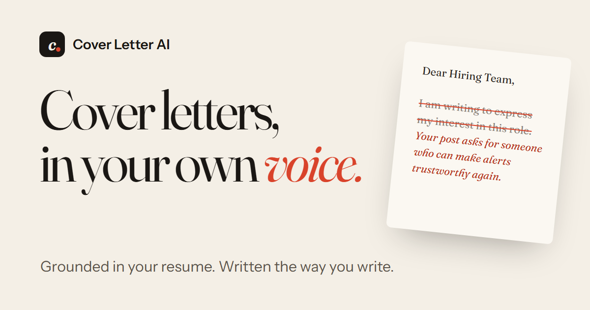

<p align="center">
  
</p>

# Cover Letter AI

Cover letters in your own voice. Upload your resume and a few letters you've written before; Cover Letter AI learns how you write, researches the company, and drafts a letter that reads like you on your best day, using only facts from your own documents.

[](LICENSE)


**Website:** - https://cap2-hi8u.onrender.com/

## How it works

1. **Teach it your voice.** Upload your resume and one to five past cover letters. It builds a style profile (tone, rhythm, habits) and a summary of your experience.
2. **Point it at a role.** Paste the job description and the company's website. It reads both.
3. **Choose your angle.** It suggests a few angles, each linking something real about the company to something real you've done. You pick one.
4. **Refine and sign.** It writes the draft, checks it against your documents, and gives you up to three revisions in plain words before you accept the final version.

Nothing is invented: every project, number and skill in a letter has to come from your own documents.

## Tech stack

| Part | What it uses |
|---|---|
| Web app | [FastAPI](https://fastapi.tiangolo.com/) with Jinja templates, plain CSS and a little JavaScript |
| Sign-in and data | [Supabase](https://supabase.com/) (Postgres with row-level security, so users only ever see their own rows) |
| AI models | [Groq](https://groq.com/) by default, through [LiteLLM](https://docs.litellm.ai/) so any provider can be swapped in |
| PDFs | [PyMuPDF](https://pymupdf.readthedocs.io/) |
| Website | Built from the app's own templates, published with GitHub Pages |

## Project layout

```text
app.py                  routes, sessions, security headers, daily limits
src/
  llm_client.py         every AI call goes through here (LiteLLM, fallbacks, cost logging)
  profile_builder.py    reads uploads and builds the candidate and style profiles
  company_researcher.py fetches the company website (public addresses only)
  anchor_generator.py   finds the angles that connect the company to the candidate
  cover_letter_generator.py  plans, writes, checks and revises the letter
  writing_framework.py  the writing rules every letter follows
  database.py           Supabase queries
templates/, static/     pages, styles, scripts, images
supabase/               schema and migrations
scripts/
  fake_backend.py       runs the whole app without any keys
  build_site.py         builds the public website into _site/
site/                   website settings (company details for the legal pages)
tests/                  unit, route and end-to-end tests
docs/                   design specs
```

## Quick start (no keys needed)

```bash
git clone https://github.com/shraddhab196-svg/cap2.git
cd cap2
python -m venv .venv
.venv/Scripts/activate        # macOS/Linux: source .venv/bin/activate
pip install -r requirements.txt
python scripts/fake_backend.py
```

Open http://127.0.0.1:8000 and sign up with any email. This runs the real app against an in-memory database and a fake AI that waits `FAKE_LATENCY` seconds (default 3), so you can click through everything. Data resets on restart.

To try the error paths: an email starting with `fail` can't log in, a company URL containing `fail` times out, and a job description containing `FAIL` (or `BUSY`) makes generation fail (or hit the rate limit).

## Running it for real

### 1. Database

Create a Supabase project, then run these in its SQL editor, in order:

1. `supabase/schema.sql`
2. `supabase/migration_add_uuid_defaults.sql`
3. `supabase/migration_chunk9_schema_reconciliation.sql`
4. `supabase/migration_add_job_applications.sql`
5. `supabase/migration_chunk10_revision_loop.sql`
6. `supabase/migration_add_job_anchors.sql`

Under **Authentication → URL Configuration → Redirect URLs**, add your app's address (for example `http://localhost:8000/**`) so the confirmation email links back to it.

### 2. Settings

Copy `.env.example` to `.env` and fill it in. `.env` is git-ignored; never commit keys.

| Variable | Required | What it does |
|---|---|---|
| `SUPABASE_URL` | yes | Your Supabase project URL |
| `SUPABASE_ANON_KEY` | yes | The project's public anon key (`SUPABASE_KEY` also works) |
| `GROQ_API_KEY` | yes | Key for the default AI provider |
| `GROQ_API_KEY_2` | no | Second Groq key, tried when the first is rate-limited. Groq limits are per account, so use a key from a different account |
| `GOOGLE_SIGN_IN` | no | `1` shows "Continue with Google" once the Google provider is set up in Supabase |
| `SESSION_SECRET` | in production | Long random string that signs the login cookie. Without it, logins reset on every restart |
| `APP_URL` | in production | Public https address. Makes the login cookie https-only and turns on HSTS |
| `DAILY_AI_LIMIT` | no | Job lookups, drafts and revisions per user per 24 hours (default 40, `0` turns it off) |
| `GROQ_MODEL` | no | Groq model name (default `qwen/qwen3.8-27b`) |
| `LLM_MODEL` | no | Any LiteLLM model name; overrides `GROQ_MODEL` |
| `LLM_FALLBACK_MODELS` | no | Comma-separated models tried in order when the primary is busy or down |
| `WORKER_THREADS` | no | Threads for slow AI and database calls per process (default 100) |
| `LOG_LEVEL` | no | Python log level (default `INFO`) |

### 3. Run

```bash
uvicorn app:app --reload
```

Open http://localhost:8000.

## Changing the AI provider

Every AI call goes through `src/llm_client.py`, so switching providers is configuration, not code:

- `LLM_MODEL` picks the main model, for example `groq/qwen/qwen3.8-27b`, `openrouter/...` or `together_ai/...`. Each provider reads its own key (`GROQ_API_KEY`, `OPENROUTER_API_KEY`, `TOGETHERAI_API_KEY`, and so on).
- `LLM_FALLBACK_MODELS` is tried in order when the main model is rate-limited or failing.
- Every call logs one line with the step, model, tokens and cost, for example `llm usage step=letter model=groq/qwen/qwen3.8-27b prompt=2140 completion=812 cost=$0.00110 seconds=3.1`. Prompts and letters are never logged.

Before adding a provider, check its data-retention and training terms (and EU hosting if your users are in the EU), since it will receive users' resumes and letters. Prompts are tuned for Qwen, so try a few real letters on a new model first.

LiteLLM is pinned to an exact version on purpose: two LiteLLM releases on PyPI were malware in March 2026. Only upgrade to releases that are at least a week old, and never install the `[proxy]` extra.

## Deploying

**The app** needs a Python server. `render.yaml` describes a free [Render](https://render.com/) web service: create a Blueprint from this repo and fill in the secrets it asks for. Free instances sleep after 15 minutes without traffic and take about a minute to wake up. `/healthz` answers without touching Supabase or the AI provider, for uptime checks.

**The website** (landing page, privacy policy, terms, imprint, 404) is built from the app's own templates by `scripts/build_site.py` and published by `.github/workflows/pages.yml` on every push to `main`.

- One-time setup by a repository admin: **Settings → Pages → Source: GitHub Actions**.
- Fill in the company details in `site/config.json`. Until then, the legal pages show "to be added".
- The repository variables `SITE_URL` and `APP_URL` override the addresses in that file.
- To preview locally: `python scripts/build_site.py` writes the site to `_site/`.

## Security and privacy

- Row-level security on every table: the app queries Supabase with the signed-in user's own token, never a service key.
- The company scraper only fetches public addresses, and checks every redirect.
- Users see our own error messages; anything unexpected is logged and replaced with a generic message.
- Resume and letter text never goes to stdout or the logs.
- Security headers on every response (content security policy, no framing, nosniff, HSTS on https), no browser caching of signed-in pages, and integrity hashes on CDN scripts.
- Uploads are capped at 5 MB, and there's a per-user daily limit on AI work.

Found a security problem? Please report it privately to the maintainers rather than opening a public issue.

## Tests

```bash
python -m pytest
```

- `tests/test_full_journey.py` walks the whole flow, from signup to an accepted letter, on the fake backend.
- `tests/test_traffic_and_isolation.py` checks that one slow request doesn't block other users, and that users never see each other's data.
- `tests/test_security.py` covers the security fixes.
- The evaluator test calls the real Groq API and is skipped without `GROQ_API_KEY`.

## Contributing

Work happens on the `dev` branch, with pull requests into `main`. Run the tests before opening a PR. Never commit `.env`, real resumes or real cover letters; tests use the made-up candidate in `tests/fixtures/`.

## License

[MIT](LICENSE)
